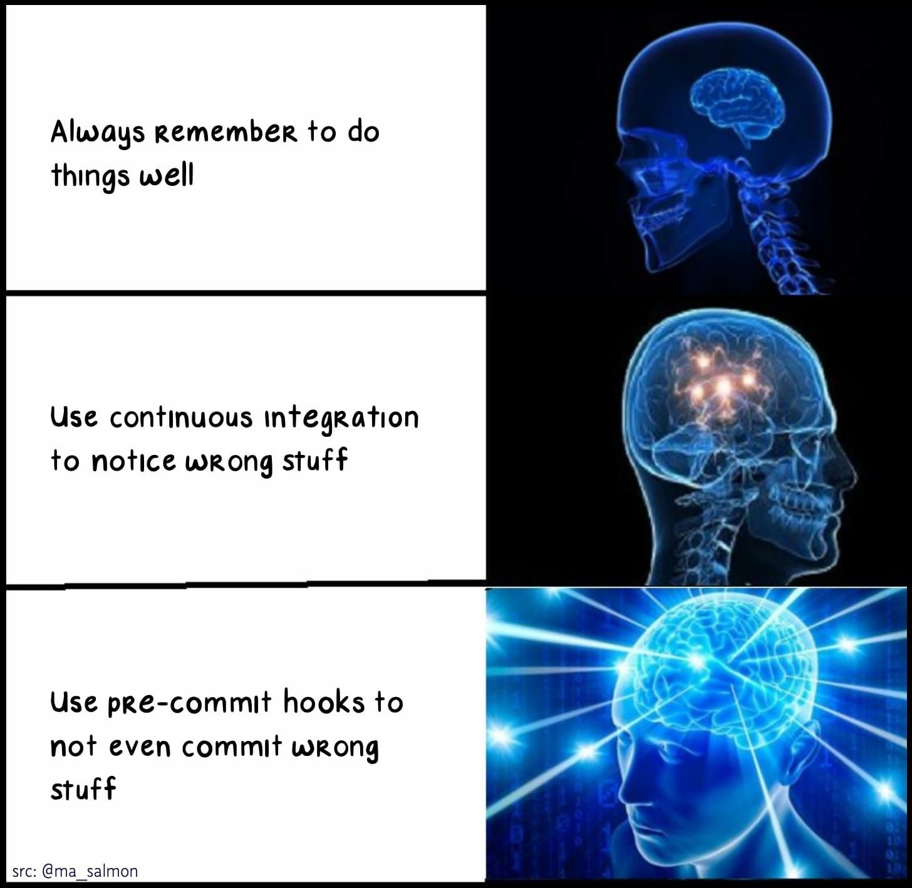

<!-- README.md is generated from README.Rmd. Please edit that file -->

# Useful git pre-commit hooks for R

<!-- badges: start -->

<!-- badges: end -->

[Pre-commit hooks](https://pre-commit.com) are tests that run each time
you attempt to commit. If the tests pass, the commit will be made,
otherwise not. A very basic test is to check if the code is parsable,
making sure you have not forgotten a comma, brace or quote. You can run
hooks locally and/or in the cloud:

-   As a check before local commits: This requires installing
    pre-commit.

-   As a CI check with <https://pre-commit.ci>: If you want to enforce
    passing hooks on pull requests (and auto-fix trivial problems like
    styling) even if the committer does not have a local installation.

## Goals of the package

The goal of this package is to twofold:

-   Provide a [set of
    hooks](https://lorenzwalthert.github.io/precommit/articles/available-hooks.html)
    that are useful when your git repo contains R code.

-   Provide [usethis](https://github.com/r-lib/usethis)-like
    functionality for common tasks such as installation and set-up and
    config file modification.

## Why do I need pre-commit hooks?

<figure>

<figcaption>
By <a href=https://twitter.com/dataandme/status/1255510799273132032>Mara
Averick</a>
</figcaption>
</figure>

For a more in-depth explanation and even more reasons, see
`vignette("why-use-hooks")`.

## Documentation

The following online docs are available:

-   [latest CRAN release](https://lorenzwalthert.github.io/precommit/).

-   [GitHub development
    version](https://lorenzwalthert.github.io/precommit/dev/).

These only cover the functionality added on top of the pre-commit
framework by this package. Everything else is covered in the extensive
[online documentation](https://pre-commit.com) of the pre-commit
framework itself, including how to create hooks for actions like
`git push` or `git checkout`, create local hooks etc.
