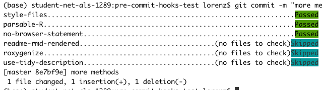

<!-- README.md is generated from README.Rmd. Please edit that file -->

# Useful git pre-commit hooks for R

<!-- badges: start -->

[](https://CRAN.R-project.org/package=precommit)
[](https://www.tidyverse.org/lifecycle/#experimental)

[](https://github.com/lorenzwalthert/precommit/actions)
<!-- badges: end -->

[Pre-commit hooks](https://pre-commit.com) are tests that run each time
you attempt to commit. If the tests pass, the commit will be made,
otherwise not. A very basic test is to check if the code is parsable,
making sure you have not forgotten a comma, brace or quote.

The goal of this package is to twofold:

  - Provide a set of hooks that are useful when your git repo contains R
    code. You can find them under `vignette("available-hooks")`.

  - Provide [usethis](https://github.com/r-lib/usethis)-like
    functionality for common tasks such as installation and set-up and
    config file modification.

## Installation

You can install the package from CRAN:

``` r
install.packages("precommit")
```

To access pre-commit functionality from R, you also need to install the
[pre-commit framework](https://pre-commit.com). The following command
line methods are tested to work with this R package:

  - `$ pip3 install pre-commit --user` (macOS, Linux and Windows)
    **outside** a conda or virtual environment.

  - `$ brew install pre-commit` (macOS).

Alternatively, you can handle the installation from R using
[miniconda](https://docs.conda.io/en/latest/miniconda.html):

  - install miniconda if you don’t have it already:
    `reticulate::install_miniconda()`. This needs reticulate \>= 1.14.

  - install the pre-commit framework with
    `precommit::install_precommit()` into the conda environment
    `r-precommit`.

Then, in a fresh R session:

``` r
# once in every git repo either
# * after cloning a repo that already uses pre-commit or
# * if you want introduce pre-commit to this repo
precommit::use_precommit()
```

The last command initializes pre-commit in your repo and performs some
set-up tasks like creating the config file `.pre-commit-config.yaml`,
where the hooks that will be run on `git commit` are specified. See
`?precommit::use_precommit()` to see how you can use a custom
`.pre-commit-config.yaml` instead of the default at initialization. You
can (obviously) change edit the file manually at any time.

## Usage

The next time you run `git commit`, the hooks listed in your
`.pre-commit-config.yaml` will get executed before the commit. The
helper function `precommit::open_config()` let’s you open and edit the
`.pre-commit-config.yaml` conveniently from the RStudio console. When
any file is changed due to running a hook or the hook script errors, the
commit will fail. You can inspect the changes introduced by the hook and
if satisfied, you can add the changes made by the hook to the index with
`git add path/to/file` and attempt to commit again. Some hooks change
files, like the styler hook, so all you need to do to make the hook pass
is `git add` the changes introduced by the hook. Other hooks, like the
parsable-R hook, will need your action, e.g. add a missing closing brace
to a call like `library(styler`, before they pass at the next attempt.
If all hooks pass, the commit is made. You can also [temporarily disable
hooks](https://pre-commit.com/#temporarily-disabling-hooks). If you
succeed, it should look like this:



See the hooks provided by this repo under `vignette("available-hooks")`.
You can also add other hooks from other repos, by extending the
`.pre-commit-config.yaml` file, e.g. like this:

``` yaml
-   repo: https://github.com/pre-commit/precommit
    rev: v1.2.3
    hooks: 
    -   id: check-added-large-files
```

To update the hook revisions, run `precommit::autoupdate()`.

## Caution

  - **Do not abort while hooks are running in RStudio git tab.**
    Non-staged changes are stashed to a temp directory and when you
    abort in RStudio, these changes are not brought back to you repo.
    Upvote [this issue](https://github.com/rstudio/rstudio/issues/6471)
    to change this. We hope that in the future, the changes will be
    recovered in RStudio too. Note that this is only an issue with
    RStudio. Stashes are restored when you abort a `git commit` with
    `INT` (e.g. Ctrl+C) on the command line. To restore stashes,
    manually after hitting *abort* in the RStudio git tab, you can `git
    apply /path/to/patch_with_id` whereas you find the patch under your
    pre-commit cache, which is usually under `$HOME/.cache/pre-commit/`.

  - Because R is not officially supported as a language in the
    pre-commit framework (yet), there is no R package dependency
    management for the R hooks provided in this repo. If an R package
    that is needed by a hook is not yet installed, you might get this
    error:

<!-- end list -->

``` r
# > Error in loadNamespace(name) : there is no package called ‘__name_of_package__’
```

In that case, just install the package with `install.packages()` once
and try to commit again. All R dependencies of the pre-commit hooks
provided in this repo are suggested dependencies of this R package, so
if you want to install them all, just `install.packages("precommit",
dependencies = c("Imports", "Suggests"))`.

## Documentation

The [online
documentation](https://lorenzwalthert.github.io/precommit/index.html) of
this package only covers the functionality added on top of pre-commit by
this package. Everything else is covered in the extensive [online
documentation](https://pre-commit.com) of the pre-commit framework
itself, including how to:

  - create pre-push hooks

  - create local hooks

  - and more

## Uninstallation

``` r
uninstall_precommit("repo") # just for the repo you are in.
uninstall_precommit("user") # remove the pre-commit conda executable.
```
